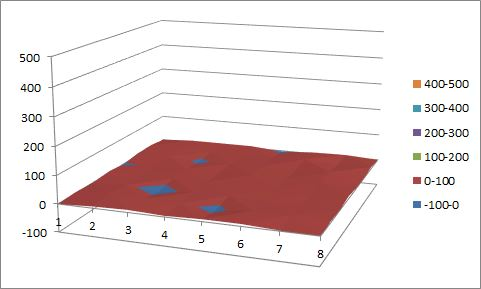
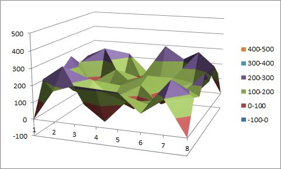

전남과학 탐구논총

Journal of Chonnam Science

\2016. 제15권, pp. 00-00.

​    

# 오델로 게임의 전략적 분석 및 학습 알고리즘 제작

이유섭(2-4)·정선진(2-4)

지도교사 류지수

​    

## 요  약

​    

 이 논문에서는 오델로 게임의 전략적 분석과 이를 이용하여 학습 알고리즘을 제작하는 과정을 다룬다. 무작위로 두는 프로그램을 통해 위치에 따른 승률을 파악하고 욕심쟁이 알고리즘과 학습 알고리즘을 적용시킨 풍수지리 알고리즘을 제작한다. 위의 알고리즘을 사용하는 인공지능 프로그램을 통해 제작된 학습 알고리즘의 성능을 파악하고 그래프 개형을 통해 이를 확인한다.

​    

**키워드**

학습 알고리즘, 오델로 게임, 전략적 분석, 모서리

​    

## Ⅰ. 도입

​    

  2016년 3월 9일, 인공지능 알파고와 인간 이세돌 간의 대국이 열렸다. 알파고는 구글이 개발한 인공지능 프로그램으로 다양한 알고리즘을 이용하여 제작되었다. 이때 알고리즘이란 어떠한 문제를 해결하기 위해 규칙들과 절차들이 모인 집합으로 정의된다.[1] 알고리즘은 주로 프로그램 제작에 쓰이는데, 이런 알고리즘을 활용하여 직접 알파고와 비슷한 게임을 제작하고자 하였다. 프로그램을 활용하여 오델로 게임 프로그램을 제작하고 게임에서 승리하기 위한 전략적 분석을 진행한 뒤 학습 알고리즘을 제작하여 프로그램에 적용해 보고자 다음 탐구를 진행하였다.

​    

​    

## Ⅱ. 이론적 배경

​    

1. 오델로

​    

  오델로(Othello)는 보드 게임의 한 종류이며, 리버시(Reversi)라고도 불린다. 두 명이 가로 세로 8칸의 오델로 판 위에서 한쪽은 검은색, 다른 한쪽은 흰색인 돌을 번갈아 놓으며 진행된다.

​    

  오델로 게임의 일반적인 규칙은 다음과 같다.

​    

​    1) 먼저 게임 참여자들의 돌 색을 결정한다. 한 플레이어는 검은색, 다른 플레이어는 흰색을 선택하게 된다. 대부분 검은색 돌을 선택한 플레이어가 선 플레이어가 된다. 

​    

​    2) 판 중앙에 2개의 돌은 검은색, 2개의 돌은 흰색으로 총 4개의 돌을 둔다.

​    

     

​    

​    3) 검은색 돌이 선공이라 생각하고 검은색 돌을 둔다.

​    

    

​    

​    4) 검은색 돌을 두고 나서 뒤집은 돌은 검은색 돌 플레이어의 소유가 된다.

​    

    

​    

​    5) 두 번째 플레이어인 흰색 돌의 플레이어는 검은색 돌을 뒤집을 수 있는 곳에 돌을 둔다. 뒤집은 돌은 흰색 플레이어의 소유가 된다.

         

​    

​    6) 더 이상 둘 곳이 없을 때 까지 위의 과정을 반복한다. 만약 한 플레이어가 둘 곳이 없다면 다음 플레이어에게로 차례가 넘어가게 된다.

​    

         

​    

​    7) 돌의 색깔에 따른 수를 센다. 더 많은 수의 색을 가지고 있는 돌의 플레이어가 승리하게 된다.

​    

    

​    

2. 알고리즘

  

 알고리즘이란 어떠한 문제를 해결하기 위한 여러 동작들의 모임이다. 

    

    

​    


이 알고리즘은 주어진 숫자들의 개수가 1개나 2개일 경우에는 그 수 혹은 평균을 출력한다. 3개 이상인 경우는 주어진 숫자들 중 최댓값과 최솟값을 삭제한 후 다시 조건문을 살피는 알고리즘이다.


​    

## Ⅲ. 탐구계획 설정


| 탐구 과제 1 – 오델로 프로그램 제작                   |
| --------------------------------------------------- |
| ① 탐구 1-1 C언어를 활용한 오델로 게임 프로그램 제작 |

| 탐구 과제 2 – 최적의 수 파악을 위한 게임의 전략적 분석 |
| ------------------------------------------------------------ |
| ① 탐구 2-1 Random AI 간의 대결구도를 통한 그래프 개형 분석   |
| ② 탐구 2-2 오델로 알고리즘 제작을 위한 경우의 수 분석        |

| 탐구 과제 3 – AI 제작을 위한 학습 알고리즘 제작 |
| ------------------------------------------------------------ |
| ① 탐구 3-1 욕심쟁이 알고리즘 제작                            |
| ② 탐구 3-2 풍수지리 알고리즘 제작                            |

| 탐구 과제 4 – 학습된 AI를 통한 그래프 분석 |
| ------------------------------------------------------------ |
| ① 탐구 4-1 다양한 조건의 AI들 간의 대결구도를 통한 그래프 분석 |
| ② 탐구 4-2 인간과의 대결구도를 통한 승리 추측 및 그래프 개형 확인 |


 이 탐구의 목적은 다음과 같다.

​    

\1) 주어진 오델로 판에서 승리할 수 있는 최적의 수를 찾을 수 있다.

\2) 승리 조건을 충족하는 새로운 학습 알고리즘을 제작할 수 있다.

\3) 학습 알고리즘을 오델로 프로그램에 적용하여 프로그램(AI)를 학습시킬 수 있다.

​    

​    

## Ⅳ. 탐구내용 및 결과

​    

Ⅰ. 탐구 과제1. 오델로 프로그램 제작

  가. 탐구 1-1. C언어를 활용한 오델로 프로그램 제작

​    

 우리는 프로그램 제작 시에 자주 사용되는 ‘C언어’ 프로그램을 이용하여 오델로 게임 프로그램을 제작하기로 하였다. 그 제작 과정은 다음과 같다.

​    

 첫번째로, 오델로 프로그램을 만들기 위해 돌을 두는 과정을 출력하는 함수를 제작하였다. PRINT_BOARD라는 함수는 실행 시킨 게임 횟수를 비롯한 정보와 보드판을 출력하는 함수이다.

​    

    

​    

 이 함수는 전역변수로 지정된 승리, 패배, 비긴 게임 횟수의 합을 총 게임 실행 횟수로 출력한다. 또한 입력 받은 판의 정보를 사용하여 현재 진행되고 있는 상황과 각각의 돌의 개수를 출력한다. 여기서 ‘0’은 빈칸, ‘1’은 빨간색 돌, ‘2’는 노란색 돌을 의미한다. 코드는 아래와 같다.

​    

```c++
// 현재 상황(보드 판) 출력 
void PRINT_BOARD(node1 p)
{
	int a=0, b=0;   // 1p와 2p의 돌의 개수 
	
	system("cls");   // 화면 지우기 
	printf("#%d\n", win+lose+draw+1);   // 진행되고있는 게임 횟수 출력
	// 보드판 출력 
	for(int i=1;i<=size;i++){
		for(int j=1;j<=size;j++){
			if(p.board[i][j]==0){   // (i,j)가 0이면
				printf("■");   // 공백 출력  
			}
			else{   // 돌이 있으면
				if(p.board[i][j]==1){   // (i,j)에 1p의 돌이 있으면 
					a++;   // a++ 
					SetConsoleTextAttribute(GetStdHandle(STD_OUTPUT_HANDLE),12);   
					// 색을 빨강색으로 바꿈
				}
				else{   // (i,j)에 2p의 돌이 있으면 
					b++;   // b++ 
					SetConsoleTextAttribute(GetStdHandle(STD_OUTPUT_HANDLE),14);   
					// 색을 노란색으로 바꿈
				}
				printf("●");   // 돌 출력 
			}
			SetConsoleTextAttribute(GetStdHandle(STD_OUTPUT_HANDLE),15);   // 색을 흰색으로 바꿈
		}
		printf("\n");
	}
	SetConsoleTextAttribute(GetStdHandle(STD_OUTPUT_HANDLE),12);   // 빨강색
	printf("%2d", a);   // 1p의 돌의 개수 출력 
	SetConsoleTextAttribute(GetStdHandle(STD_OUTPUT_HANDLE),15);   // 흰색 
	printf(" vs ");
	SetConsoleTextAttribute(GetStdHandle(STD_OUTPUT_HANDLE),14);   // 노란색 
	printf("%2d", b);   // 2p의 돌의 개수 출력 
	SetConsoleTextAttribute(GetStdHandle(STD_OUTPUT_HANDLE),15);   // 흰색 
	printf("\n");
}
```


 이 함수는 function.h 헤더파일에서 정의한 구조체를 사용한다.

​    


```c++
#define size 8

struct node1{
	int board[size+2][size+2];
};
```


 

다음은 게임진행을 위한 헤더파일이다. game.h 헤더파일의 PLAY_GAME 함수는 게임 상황을 판단하는 함수들을 포함한 여러 함수들을 활용하여 전체적인 게임을 진행시킨다.


```c++
// 게임을 진행시키는 함수 
void PLAY_GAME()
{ 
	int k=1, xy, z;
	// k : 차례 표시(1 : 1p / 2 : 2p)
	// xy : 좌표 (10의 자리 : x좌표 / 1의 자리 : y좌표) 
	// z : 게임의 승패 여부 (0 : 무승부 / 1 : 1p승 / 2 : 2p승) 
	  
	SETUP();   // 게임 설정 
	 
	PRINT_BOARD(game);   // 보드판 출력
	// 게임 진행 
	while(!THE_END(game)){   // 게임이 끝나지 않을 때까지 
		k = 3-k;   // 차례 바꾸기
		if(k==1){   // 1p 차례일 때 
			if(CAN_DO(game)){   // 둘 곳이 있으면 
				xy = RANDOM_TURN(game);   // 랜덤 좌표 선택 
				REMEMBER(game,xy,1);   // 1p가 둔 좌표 저장 
				game = PUT(game,xy/10,xy%10);   // 돌 놓기 
			}
			else{   // 둘 곳이 없으면
				// 돌을 두지 않고
				printf("ONE MORE\n");   // "ONE MORE"출력 후 
				continue;   // 차례 넘김 
			}
		}
		else{   // 2p차례일 때
			// option.h헤더파일의 모든 함수는 1p가 기준. 1p의 입장으로 판 바꾸기
			game = FLIP(game);   // 판을 뒤집기(판을 1p의 입장으로 변환)
			if(CAN_DO(game)){   // 둘 곳이 있으면 
				xy = RANDOM_TURN(game);   // 랜덤 좌표 선택 
				REMEMBER(game,xy,-1);   // 2p가 둔 좌표 저장 
				game = PUT(game,xy/10,xy%10);   // 돌 놓기 
			}
			else{   // 둘 곳이 없으면
				//돌을 두지 않고
				printf("ONE MORE\n");   // "ONE MORE"출력 후 
				game = FLIP(game);   // 판을 뒤집고(원상복귀시키고) 
				continue;   // 턴 넘김 
			}
			game = FLIP(game);   // 판을 뒤집음(원상복귀시킴) 
		}
		PRINT_BOARD(game);   // 보드판 출력 
	}
	z = WHO_WIN(game);   // 누가 이겼는지 판단 
	if(z==0){   // 무승부이면
		draw++;   // 무승부 횟수+1 
		ANALYSIS(0);   // 결과 분석 
	}
	else if(z==1){   // 1p 승리 시
		win++;   // 승리 횟수+1 
		ANALYSIS(1);   // 결과 분석 
	}
	else{   // 2p가 승리 시
		lose++;   // 패배 횟수+1 
		ANALYSIS(-1);   // 결과 분석
	}
}
```


​    

 위의 PLAY_GAME 함수에서 사용된 함수들은 게임의 기본 설정을 해주는 함수인 SETTING 함수와 상황을 판단해주는 함수인 THE_END, CAN_DO, WHO_WIN 함수, 둘 곳을 선택하는 RANDOM_TURN,, GREEDY_AI_TURN, AI_TURN, USER_TURN 함수, 데이터를 바꾸는 PUT, FLIP 함수 마지막으로 데이터를 분석하는 REMEMBER, ANALYSIS 함수로 분류할 수 있다.

​    

​    \1) 게임의 기본 설정을 해주는 함수

​    

​        가. SETTING 함수

​    게임 시작 전, 게임에 필요한 기본 설정을 해주는 함수로, 랜덤 함수를 사용하기 위한 함수 선언, 배열 초기화, 데이터 입력을 한다.

​    


```c++
void SETUP()   // 게임 시작 전 설정
{
	srand(time(NULL));   // 랜덤함수(rand())를 사용하기 위한 함수 
	 
	// 보드판 초기화 
	for(int i=1;i<=size;i++){
		for(int j=1;j<=size;j++){
			game.board[i][j] = 0;
			put_.board[i][j] = 0;
			eat_.board[i][j] = 0;
		}
	}
	game.board[4][4] = game.board[5][5] = -1;
	game.board[4][5] = game.board[5][4] = 1;
	 
	// put_board와 eat_board 입력 (random vs random.txt파일에서 입력) 
	FILE *in;
	in = fopen("random vs random.txt","r"); 
	for(int i=1;i<=size;i++){
		for(int j=1;j<=size;j++){
			fscanf(in, "%d", &put.board[i][j]);
		}
	}
	for(int i=1;i<=size;i++){
		for(int j=1;j<=size;j++){
			fscanf(in, "%d", &eat.board[i][j]);
		}
	}
	fscanf(in, "%d %d %d", &win, &lose, &draw); 
	fclose(in);
}
```


​    

​    \2) 게임 상황을 판단해주는 함수

​    

​        가. CHECK_PUT 함수
  현재 판의 상태와 특정 좌표를 입력 받아 선 플레이어를 기준으로 하여 그 곳에 돌을 둘 수 있는지 판단하는 함수이다.

​    


```c++
// 1p가 둘 수 있는지 판단
// p, x, y : p 판에서 (x,y)에 1p가 둘 수 있는지 판단
// return true : 판p에서 (i,j)에 두는게 가능
// return false : 판p에서 (i,j)에 두는 게 불가능
bool CHECK_PUT(node1 p, int x, int y)
{
	if(p.board[x][y]!=0) return false;   // 돌이 있으면 둘 수 없다고 반환
	for(int i=-1;i<=1;i++){   // 상하
		for(int j=-1;j<=1;j++){   // 좌우
			if(p.board[x+i][y+j]==-1){   // (i,j)방향에 2p의 돌이 있으면
				for(int l=2;true;l++){   // (i,j)방향의 그 다음 돌부터
					if(p.board[x+l*i][y+l*j]==0) break;   
				    // 빈칸이 나올 경우 먹을 수 없는 돌이므로 (i,j)방향 탐색 종료
					if(p.board[x+l*i][y+l*j]==1) return true;  
				    // 1p의 돌이 나올 경우 상대 돌을 먹을 수 있으므로 true 반환
				}
			}
		}
	}
	return false;   // 둘 수 있는 곳이 없으면 false 반환 
}
```


​    

​        나. THE_END 함수
 현재 판의 상황을 입력 받아 모든 칸에 대해 선플레이어와 후플레이어가 돌을 둘 수 있는지를 판단해 두 사람 모두 둘 수 있는 곳이 없으면 true를 반환한다.

​    


```c++
// 게임의 종료 여부 판단
// return true : 게임 종료
// return false : 게임 진행 
bool THE_END(node1 check)
{
	bool a=false, b=false, x=false, y=false, z=false;
	// a, b : 1p와 2p의 돌의 존재 유무 (false가 존재하면 게임 종료)
	// x, y : 1p와 2p가 둘 수 있는지의 여부 (둘 다 false이면 게임 종료)
	// z : 빈칸의 존재 유무 (false이면 게임 종료)
	 
	// 게임 종료 판단
	for(int i=1;i<=size;i++){
		for(int j=1;j<=size;j++){
			if(check.board[i][j]==0) z = true;   // 빈칸이 있으면 z=true
			if(check.board[i][j]==1) a = true;   // 1p의 돌이 있으면 a=true
			if(check.board[i][j]==-1) b = true;   // 2p의 돌이 있으면 b=true
			// CHECK_PUT함수는 1p가 둘 수 있는지 판단하므로
			// 2p 판별 시 판을 뒤집고 CHECK_PUT함수 호출
			if(CHECK_PUT(check,i,j)) x = true;   // 1p가 둘 수 있으면 x=true
			if(CHECK_PUT(FLIP(check),i,j)) y = true;   // 2p가 둘 수 있으면 y=true
		}
	}
	if(!a || !b || (!x &&!y) || !z) return true;   // 둘 수 없으면 true 호출
	return false;   // 그렇지 않으면 false 호출
}
```


​    

​        다. CAN_DO
 현재 판의 상황을 입력 받아 선 플레이어가 둘 곳이 있는지를 판단한다.

​    


```c++
// 1p가 둘 곳이 있는지 판단
// return true : 1p가 두는게 가능
// return false : 1p가 두는게 불가능 
bool CAN_DO(node1 p)
{
	for(int i=1;i<=size;i++){
		for(int j=1;j<=size;j++){
			if(CHECK_PUT(p,i,j)) return true;  // (i,j)에 둘 수 있으면true 반환 
		}
	}
	return false;   // 둘 수 있으면 false 반환 
}
```


​    

​    라. WHO_WIN
 누가 이겼는지 판단하는 함수이다.

​    


```c++
// 누가 이겼는지 판단
// return 0 : 무승부
// return 1 : 1p 승
// return 2 : 2p 승 
int WHO_WIN(node1 p)
{
	int a=0, b=0;   // 1p와 2p의 돌의 개수 
	for(int i=1;i<=size;i++){
		for(int j=1;j<=size;j++){
			if(p.board[i][j]==1) a++;   // 1p의 돌이 있으면 a++ 
			if(p.board[i][j]==-1) b++;   // 2p의 돌이 있으면 b++ 
		}
	}
	if(a==b) return 0;   // 1p와 2p의 돌의 개수가 같으면 무승부 
	else if(a>b) return 1;   // 1p가 2p의 돌의 개수보다 많으면 1p 승 
	else return 2;   // 1p가 2p의 돌의 개수보다 적으면 2p 승 
}
```


​    

​    \3) 둘 곳을 결정하는 함수

​    

​        가. RANDOM_TURN
 판의 정보를 입력 받아 둘 수 있는 곳 중 임의로 한 곳을 선택하여 반환한다.

​    


```c++
// 랜덤으로 두기
// 판 p에서 들 수 있는 곳 중 랜덤으로 좌표 반환
// return p*10+q : (p,q)에 둠 
int RANDOM_TURN(node1 p)
{
	int x, y;   // 랜덤으로 지정한 좌표 
	 
	// 랜덤으로 좌표 선택 
	x = rand()%size+1;
	y = rand()%size+1;
	while(!CHECK_PUT(p,x,y)){   // 랜덤으로 지정한 곳에 돌을 둘 수 없으면
		// 좌표 재지정 
		x = rand()%size+1;
		y = rand()%size+1;
	}
	 
	return x*10+y;   // 지정한 좌표 반환
}
```


​    

​    \4) 데이터를 바꾸는 함수

​    

​        가. PUT
 판의 정보와 돌을 둘 좌표를 입력받아 규칙에 맞게 돌을 둔 후의 판을 반환한다.

​    


```c++
// 돌 놓기
// p, x, y : 판 p의 (x,y)에 돌 놓기 
// 돌을 놓은 판 반환 
node1 PUT(node1 p, int x, int y)
{
	p.board[x][y] = 1;   // (x,y)에 돌 놓음
	for(int i=-1;i<=1;i++){   // 상하 
		for(int j=-1;j<=1;j++){   // 좌우에 
			if(p.board[x+i][y+j]==-1){   // (i,j)방향에 2p의 돌이 있으면 
				for(int l=2;true;l++){   // (i,j)방향의 그 다음 돌부터 
					if(p.board[x+l*i][y+l*j]==0) break;   
				   // 빈칸이 나오면 먹을 수 없는 돌이므로 (i,j)방향 탐색 종료
					if(p.board[x+l*i][y+l*j]==1){   // 1p의 돌이 나오면
						// 1p의 돌이 나오기 전까지
						for(int k=1;k<l;k++){
							p.board[x+k*i][y+k*j] = 1;
							// (i,j)방향의 돌을 1p의 돌로 뒤집음
						}
						break;   // (i,j)방향 탐색 종료 
					}
				}
			}
		}
	}
	return p;   // 돌을 놓은 판 반환 
}
```


​    

​    

​    

​    

​        나. FLIP
 대부분의 함수는 첫 번째 둔 사람을 기준으로 실행된다. 따라서 두 번째 둔 사람이 함수를 사용하기 위해 이 함수에서는 모든 돌을 뒤집은 판의 정보를 반환하여 앞에 정의된 함수들을 사용할 수 있게 한다.


```c++
// 판 뒤집기
// 뒤집은 판 반환 
node1 FLIP(node1 p)
{
	for(int i=1;i<=size;i++){
		for(int j=1;j<=size;j++){
			p.board[i][j] *= -1; 
		}
	}
	return p;
}
```


​    

​    \5) 데이터를 분석하는 함수

​    

​        가. REMEMBER
 둔 곳을 분석하기 위해 각각의 플레이어들이 둔 곳을 저장하는 함수이다. 이 때 둔 곳의 위치가 중요하므로 판의 크기와 동일한 2차원 배열에 데이터를 저장한다.

​    


```c++
// 데이터 저장
// 판p의 k좌표에 z가 뒀을 때를 의미
// k : 10의 자리 : x좌표 / 1의 자리 : y좌표
// z : 1 : 1p가 둔 경우 / -1 : 2p가 둔 경우
void REMEMBER(node1 p, int k, int z)
{
	int x, y;   // 좌표 
	// k의 좌표를 쓰기 편하게 전환 
	x = k/10;
	y = k%10;
	 
	put_.board[x][y] = z;   // (x,y)에 z가 뒀다고 표시
	// 먹는 돌 판별 
	for(int i=-1;i<=1;i++){
		for(int j=-1;j<=1;j++){
			if(p.board[x+i][y+j]==-1){
				for(int l=2;l<=7;l++){ 
					if(p.board[x+l*i][y+l*j]==0) break;
					if(p.board[x+l*i][y+l*j]==1){
						for(int k=1;k<l;k++){
							eat_.board[x+k*i][y+k*j] += z;
							// z가 먹은 돌 표시 
						}
						break;
					}
				}
			}
		}
	}
}
```


​        나. ANALYSIS
 플레이어들이 둔 곳을 승패의 결과에 따라 이전 데이터에 누적하여 저장한다.

​    


```c++
// z가 이겼을 때 데이터 분석
// z : 1 : 1p가 둔 경우 / -1 : 2p가 둔 경우
void ANALYSIS(int z)
{
	// random vs random.txt파일 열기 
	FILE *out;
	out = fopen("random vs random.txt","w");
	 
	// put_board 갱신 
	for(int i=1;i<=size;i++){
		for(int j=1;j<=size;j++){
			fprintf(out, "%d    ", put.board[i][j] + z*put_.board[i][j]);   
		    // 기존 put_board + 새로운 put_boarad 
		}
		fprintf(out, "\n");
	}
	fprintf(out, "\n");
	 
	// eat_board 갱신 
	for(int i=1;i<=size;i++){
		for(int j=1;j<=size;j++){
			fprintf(out, "%d    ", eat.board[i][j] + z*eat_.board[i][j]);   
		// 기존 eat_board + 새로운 eat_boarad 
		}
		fprintf(out, "\n");
	}
	fprintf(out, "\n");
	 
	fprintf(out, "%d %d %d\n", win, lose, draw);   // 승패무 기록 
	fclose(out);   // 파일 입출력 종료 
}
```


​    

 또한 다음 헤더파일은 사용된 모든 함수를 선언하고 헤더파일을 참조하는 파일로, cpp파일에서 이 헤더파일 하나만 참조하면 모든 함수를 사용할 수 있다.

​    


```c++
#define size 8

struct node1{
	int board[size+2][size+2];
};

int win, lose, draw;
node1 game, put, eat, put_, eat_;

void SETUP();   // 게임 시작 전 설정
void PLAY_GAME();   // 게임을 진행시키는 함수 
void PRINT_BOARD(node1 p);   // 현재 상황(보드 판) 출력
bool THE_END(node1 check);   // 게임의 종료 여부 판단
bool CHECK_PUT(node1 p, int x, int y);   // 1p가 둘 수 있는지 판단
node1 FLIP(node1 p);   // 판 뒤집기
node1 PUT(node1 p, int x, int y);   // 돌 놓기
bool CAN_DO(node1 p);   // 1p가 둘 곳이 있는지 판단
int WHO_WIN(node1 p);   // 누가 이겼는지 판단
void REMEMBER(node1 p, int k, int z);   // 데이터 저장
void ANALYSIS(int z);   // z가 이겼을 때 데이터 분석

int RANDOM_TURN(node1 ai);   // 랜덤으로 두기

#include "print.h"
#include "game.h"
#include "option.h"
#include "analysis.h"
#include "random_ai.h"
```


​    

 cpp파일은 프로그램에 사용된 기본 헤더파일과 fuction.h 헤더파일을 참고하여 진행하고자 하는 게임 횟수를 입력받아 입력받은 게임 횟수가 될 때까지 게임을 진행시킨다.

​    


```c++
#include <stdio.h>
#include <conio.h>
#define POINT trash
#include <windows.h>
#undef POINT
#include <stdlib.h>
#include <time.h>

using namespace std;

#include "function.h"

int main()
{
	int n;
	scanf("%d", &n);   // 진행하고자 하는 횟수 입력
	SETUP();   // 진행했던 횟수(win + lose + draw) 입력을 위해 호출 
	while(win+lose+draw < n){   // 진행했던 횟수가 n번 이하이면
		PLAY_GAME();   // 게임 진행
	}
	return 0;
}
```


Ⅱ. 탐구 과제2. 최적의 수 판단을 위한 게임의 전략적 분석

  가. 탐구 2-1. Random AI 간의 대결구도를 통한 그래프 개형 분석

​    

 우리는 오델로 게임 보드판을 이용하여 어느 위치에 놓았을 때 가장 이길 확률이 높은지 조사하고자 하였다. 무작위로 두는 AI를 이용하여 결과 값을 얻어내고 이를 그래프화 하여 분석하고자 다음 탐구를 진행하였다.

​    

​    \1) 그래프를 이용한 최적의 수 분석

​    

 Random과 Random이 대결 구도를 형성하여ㄷ 게임이 진행된 후, 나타나는 결과 그래프는 다음과 같다.

​    

    

​    

    

​    


  위 그래프에서 가로축과 세로축은 오델로 게임판을, 높이는 데이터의 가중치 값을 나타낸다. 그래프에서 높은 부분은 그 부분의 값이 계속적으로 누적되었음을 의미한다. 

​    

    

​    

    

​    

 이 그래프에서 가로축과 세로축은 오델로 게임판을, 높이는 데이터의 가중치 값을 나타낸다. 이 그래프는 먹은 돌의 위치의 값이 더해지는 방식으로 나타난다.


| 20364 | -3830 | 3550  | 752  | -2362 | 4410  | -7662 | 22280 |
| ----- | ----- | ----- | ---- | ----- | ----- | ----- | ----- |
| -9005 | -3248 | -3104 | 3377 | -2520 | 1786  | -7506 | -4720 |
| 4446  | -8994 | 3960  | 2218 | -3242 | 2802  | 3552  | 1756  |
| 434   | 1918  | -3698 | 0    | 0     | -1032 | 1026  | -3838 |
| 6     | -630  | -428  | 0    | 0     | -2060 | -3236 | 2946  |
| 1480  | 2952  | -5176 | 5764 | -4700 | 4988  | -3530 | 1488  |
| -4152 | -5156 | -2812 | 3082 | -1036 | -1768 | -5016 | -1200 |
| 20826 | -2934 | -4436 | 5024 | 618   | -304  | -4716 | 16670 |


​     

​    \2) 결과 해석

​      ① 오델로 게임판에서 꼭짓점에 돌을 둘 경우 게임에서 이길 확률이 가장 높다.

​      ② 꼭짓점과 가장 인접한 부분은 -값을 보이며 그 승률이 낮다.

​      ③ 우리가 먹었을 때 나타나는 판에서 꼭짓점의 가중치 값은 0이 나옴을 확인 할 수 있다. 이는           꼭짓점에 돌을 두게 되면 이후에 일어나는 게임과정에서 그 돌은 절대로 먹히지 않음을 보여           준다.

​      ④ 무작위로 두는 AI들이 나타내는 그래프 값은 게임판에 대한 승률을 나타낸다.


100000번의 대결 결과 put board에서는 꼭짓점이 가장 높게, eat board에서는 꼭짓점에 가장 낮게 나타남을 확인 할 수 있다. 두는 곳의 가중치는 꼭짓점 부분에서 가장 높게 나타나는 것을 보아 꼭짓점 부분에서의 승률이 가장 높은 것을 알 수 있다. 또한 우리가 먹히는 곳의 가중치는 꼭짓점 부분에서 모두 0을 기록하였다. 이는 꼭짓점 부분에 둘 경우 그 후에 절대로 먹힐 수 없다는 것을 의미한다. 이를 통해 오델로 게임에서 꼭짓점에 돌을 두는 경우 이길 확률이 높아짐을 알 수 있다.


   

​    \3) 학습 알고리즘 제작을 위한 경우의 수 분석

​    

​      ① 오델로 알고리즘 전략적 분석

​        가) 앞 수를 생각하지 않고 현재의 상황에서 무조건 많이 먹는다.

​    

          

​    

 [그림 16]과 같은 상황에서 백이 둘 수 있는 곳은 [그림 17]과 같이 5군데가 있다.

 이중 백이 1과 5의 위치에 두면 흑돌 2개를, 2와 3의 위치에 두면 흑돌 1개를, 4의 위치에 두면 흑돌 3개를 먹을 수 있다. 아래의 그림은 백이 1, 2, 4의 위치에 둔 경우이다.

​    

                  

​    

​        나) 어떠한 상황에서도 가장 적게 먹히도록 돌을 둔다.

​    

           

​    

 [그림 21]과 같은 상황에서 백이 둘 수 있는 곳은 [그림 22]와 같이 10군데가 있다.

 이중 백이 3의 위치에 두면 [그림 23]과 같이 4개의 돌을 먹어 가장 많이 먹을 수 있다.

​    

    

​    

그러나 백이 3의 위치에 둔 경우 흑이 [그림 24]와 같이 두면 5개를 먹혀 결국 1개를 먹힌 꼴이 된다.

​    

           

​    

 그러나 백이 5의 위치에 두면 [그림 26]와 같이 3개를 먹어 3의 위치에 둔 것보다 적게 먹지만 흑이 [그림 27], [그림 28]과 같이 최대 3개밖에 먹지 못하기 때문에 결국 득실이 없어 백이 3의 위치에 둔 것보다 더 좋은 결과를 얻을 수 있다.

​    

    

​    

           

​    

​        다) 다음 차례에서 상대가 둘 수 없는 상황을 만든다.

​    

                  

​    

 [그림 29]의 상황에서 [그림 30]과 같이 두면 [그림 31]과 같이 흑이 둘 곳이 없어 백이 한 번 더 둘 수 있게 된다.

​    

​        라) 상대가 가장 낮은 가중치(꼭짓점과 인접한 부분)에 돌을 두도록 유도한다.

​    

           

​    

           

​    

 [그림 31]과 같은 상황에서 백이 [그림 32], [그림 33]과 같이 두면 흑이 둘 수 있는 곳이 한 곳 밖에 없어 [그림 34], [그림 35]와 같이 좋지 않다고 판단되는 위치에 두게 된다.

​    

​      ② 가중치 분석

​        가) 돌을 특정한 위치에 두었을 때의 그 위치가 가지고 있는 가중치

​        나) 돌을 특정한 위치에 두었을 때 먹을 수 있는 돌들의 가중치 합 (총 개수)

​        다) 상대편이 얻을 수 있는 최대 점수 

​     (특정 위치에 돌을 둔 후 그 다음 수에 상대편이 얻을 수 있는 가중치 합)

​    

​      → 가)+나)-다)의 수식을 이용하여 값을 계산한다.

​    

​    

Ⅲ. 탐구 과제3. AI제작을 위한 학습 알고리즘 제작

 

우리는 위의 결과를 토대로 하여 오델로 프로그램이 학습 할 수 있는 알고리즘을 직접 제작하였다.  

​    

  가. 탐구 3-1. 욕심쟁이 알고리즘 제작

​    

​      가) 욕심쟁이 알고리즘 : 많이 먹을 수 있는 곳에 두는 알고리즘 이다.

​    

​      나) 장점

​          ① 읽은 수들에 한하여 현재 상황애서 최선의 선택을 할 수 있다. (특히 게임이 거의 끝났을 때, 남아있는 차례에서 가장 최선의 선택을 할 수 있다.)

​    

​      다) 단점

​          ① 읽지 못한 수들에 대한 변수 예측이 불가능하다.

​          ② 최선의 경우에 대한 역 결과가 나타날 수 있다.

​    

​      라) 한계

​          ① 앞수를 예측하는데 소비되는 시간상의 이유로 6수 이상을 앞서 읽지 못한다.

​          ② 읽는 수의 제한으로 많은 수를 앞서 보지 못한다.

​          ③ 최대한 많은 개수의 돌을 먹는 것을 목적으로 하기 때문에 읽지 못한 수들에 대하여 대처하기 어렵다.

​    

    

 


  다음은 차례로 위의 욕심쟁이 알고리즘의 flow chart에 맞게 작성한 GREEDY_AI_TURN함수와 LOOK함수, POINT 함수이다.

​    


```c++
// 판의 상황이 주어졌을 때 돌 두기
// 두 자리 수로 좌표 반환
// 십의 자리 : x좌표
// 일의 자리 : y좌표 
int GREEDY_AI_TURN(node1 ai)
{
	int x, y;   // x좌표와 y좌표 
	node2 k;	 
	k = LOOK(ai,0);   // 둘 곳 탐색 
	x = k.xy/10;   // 반환된 값을 x 좌표로 전환 
	y = k.xy%10;   // 반환된 값을 y 좌표로 전환 
	return x*10+y;   // 좌표 반환 
}
```


​    


```c++
#define min_point –100000000.0

node2 LOOK(node1 p, int q)
{
	int c=0;
	double point;
	node2 k;
	k.point = k.xy = 0;   // k값 초기화 
	if(q==5) return k;   // 5수 앞까지 본 후, 탐색 종료 
	k.point = min_point;   // 점수를 최솟값으로 설정
	
	for(int i=1;i<=size;i++){
		for(int j=1;j<=size;j++){   // 모든 좌표 탐색
			if(!CHECK_PUT(p,i,j)) continue;   // 둘 수 없으면 넘어감
			point = POINT(p,i,j)-LOOK(FLIP(PUT(p,i,j)),q+1).point;
			// 점수 = 해당 점수 - 다음 턴에 상대가 얻을 수 있는 점수
			if(point>k.point){   // 이전까지의 점수보다 현재 점수가 높으면 
				k.point = point;   // 점수 갱신 
				k.xy = i*10+j;   // 좌표 갱신 
			}
		}
	}
	if(k.xy==0){   // 좌표 갱신이 되지 않았으면 (둘 수 있는 곳이 없으면)
		k.point = -10000000;   // -10000000점수 부여
	}
	return k;   // 점수와 좌표가 저장된 구조체 반환
}
```


​    

 9번째 줄에서 조건문 안의 숫자 5는 5수 앞까지 탐색하는 것을 의미한다.


```c++
// 점수 계산
// 판 p에서 좌표 (x,y)에 뒀을 때의 점수 계산
// 점수 반환 
double POINT(node1 p, int x, int y)
{
	double point=1;   // 점수 1로 초기화
	for(int i=-1;i<=1;i++){
		for(int j=-1;j<=1;j++){   // 8방향 탐색
			if(p.board[x+i][y+j]==-1){   // 상대의 돌이 있으면
				for(int l=2;l<=7;l++){   // 그 줄 탐색
					if(p.board[x+l*i][y+l*j]==0) break;
					// 빈칸이 먼저 나오면 탐색 종료
					if(p.board[x+l*i][y+l*j]==1){
					// 나의 돌이 먼저 나오면
						// 상대 돌의 개수 더하기
						for(int k=1;k<l;k++){
							point++;
						}
						break;   // 탐색 종료 
					}
				}
			}
		}
	}
	return point;   // 점수 반환
}
```


 게임 규칙들을 포함한 모든 게임 진행은 탐구 과제 1에서 greedy.h 헤더 파일 이외의 소스 파일들과 동일하므로 game.h 헤더파일 중 RAMDOM_TURN 함수만 GREEDY_AI_TURN 함수로 바꾸어주면 된다.

​    

  나. 탐구 3-2. 풍수지리 알고리즘 제작

​    

​      가) 풍수지리 알고리즘

​         : 게임을 진행하는 동안 이 알고리즘은 승자와 패자가 두는 곳을 학습하고 분석한다. 그 다음 게임에서는 학습된 결과를 토대로 다음 차례의 점수까지 계산하여 어느 곳에 돌을 둘 것인지 결정한다. 이때 이 알고리즘은 계산된 점수가 가장 높은 곳에 돌을 두게 한다.

​    

​      나) 장점

​          ① 이 알고리즘은 승자가 두었던 곳을 분석하기 때문에 가장 좋은 수를 예측할 수 있다.

​          ② 학습된 결과를 토대로 하여 예측을 하기 때문에 이 알고리즘은 욕심쟁이 알고리즘과 비교했을 때, 더 정확한 예측을 할 수 있다.

​          ③ 게임이 진행될수록 꾸준한 학습을 하므로 더욱더 발전된 전략적 접근을 할 수 있다.

​    

​      나) 단점

​          ① 과도한 전략적 접근으로 게임의 본래의 목적을 상실할 수 있다.
 (돌이 아닌 점수만을 얻기 위한 AI가 될 수 있다.)

​          ② 게임의 막바지에서 가장 좋지 않은 곳에 둘 가능성이 존재한다.

​          ③ 이 알고리즘은 상대방이 둘 곳을 분석하기 때문에 만약 사용자가 게임 도중 게임 스타일을 바꾼다면 AI가 질 가능성을 가지게 된다.

​          ④ 게임이 어떠한 방식으로 진행되는지에 관계없이 이 알고리즘은 같은비율로 데이터를 학습한다. 따라서 오델로 게임을 잘 두지 못하는 사람과 대결해 계속적으로 학습하게 되면, 이 알고리즘이 좋지않은 곳에 돌을 둘 가능성이 커진다.

  

    


다음은 위의 풍수지리 알고리즘의 flow chart에 맞게 작성한 GREEDY_AI_TURN함수와 POINT 함수이다. 이 때 LOOK 함수는 욕심쟁이 알고리즘의 LOOK 함수와 동일하다.

​    


```c++
// 판의 상황이 주어졌을 때 돌 두기
// 두 자리 수로 좌표 반환
// 십의 자리 : x좌표
// 일의 자리 : y좌표 
int AI_TURN(node1 ai)
{
	int x, y;   // x좌표와 y좌표 
	node2 k;	 
	k = LOOK(ai,0);   // 둘 곳 탐색 
	x = k.xy/10;   // 반환된 값을 x 좌표로 전환 
	y = k.xy%10;   // 반환된 값을 y 좌표로 전환 
	return x*10+y;   // 좌표 반환 
}
```


우리는 random의 그래프 결과를 분석한 결과를 토대로 하여 두가지 조건의 학습 알고리즘을 제작하였다. 욕심쟁이 알고리즘은 무조건 많은 수의 돌을 먹는 알고리즘이며, 풍수지리 알고리즘은 둘수있는 곳에서 가장 높은 점수를 가지고 있는 곳에 돌을 두는 알고리즘이다.


Ⅳ. 탐구 과제4. AI의 대결구도를 통한 유사한 그래프 개형 도출

​    

  가. 탐구 4-1. 다양한 조건의 AI간의 대결구도를 통한 그래프 분석

​    

 우리는 학습된 데이터 결과를 토대로 하여 1수 앞을 볼 수 있는 AI, 3수 앞을 볼 수 있는 AI 그리고 5수 앞을 볼 수 있는 AI를 제작하였다. 이러한 AI들의 대결구도를 형성하여 앞 수를 많이 볼수록 게임에 어떠한 영향을 미치는지, AI들 간의 대결을 통해 학습 되는 결과는 어느 정도인지 판단하고자 다음 탐구를 진행하였다.

​    

​    \1) 프로그램 제작


​       여기서 사용한 알고리즘은 풍수지리 알고리즘으로 소스코드는 탐구 과제 3에서 작성한 코드를 사용한다. 이 때 LOOK 함수에서 9번째 줄 조건문 안의 숫자를 조절하여 1수, 3수, 5수 앞을 보는 AI를 만들 수 있다.

​    

​    \2) 학습된 결과를 그래프로 표현

​    

​    (1) AI(1) VS AI(3)


|            | put board                                                    | eat board                |
| ---------- | ------------------------------------------------------------ | ------------------------ |
| 10 times   |                                      |  |
| 20 times   |                                      |  |
| 30 times   |                                      |  |
| 40 times   |                                      |  |
| 50 times   |                                      |  |
| 60 times   |                                      |  |
| 70 times   |                                      |  |
| 80 times   |                                      |  |
| 90 times   |                                      |  |
| 100 times  |                                      |  |
| 200 times  |                                      |  |
| 300 times  |                                      |  |
| 400 times  |  |  |
| 500 times  |                                      |  |
| 600 times  |                                      |  |
| 700 times  |                                      |  |
| 800 times  |                                      |  |
| 900 times  |                                      |  |
| 1000 times |                                      |  |
| 2000 times |                                      |  |
| 3000 times |                                      |  |


​    

​    (2) AI(3) VS AI(5)


|            | put board                | eat board                |
| ---------- | ------------------------ | ------------------------ |
| 10 times   |  |  |
| 20 times   |  |  |
| 30 times   |  |  |
| 40 times   |  |  |
| 50 times   |  |  |
| 60 times   |  |  |
| 70 times   |  |  |
| 80 times   |  |  |
| 90 times   |  |  |
| 100 times  |  |  |
| 200 times  |  |  |
| 300 times  |  |  |
| 400 times  |  |  |
| 500 times  |  |  |
| 600 times  |  |  |
| 700 times  |  |  |
| 800 times  |  |  |
| 900 times  |  |  |
| 1000 times |  |  |


1수 앞을 보는 AI와 3수 앞을 보는 AI의 대결 결과 random간 대결 그래프와 유사한 그래프가 나타남을 확인하였다. 3수 앞을 보는 AI와 5수 앞을 보는 AI의 대결 결과에서도 마찬가지로 random간 대결 그래프와 유사한 그래프가 나타남을 확인하였다. 1수, 3수의 그래프와 3수, 5수 그래프를 비교해보았을 때, 3수, 5수의 그래프가 random간 대결 그래프와의 유사도가 훨씬 높음을 확인할 수 있었다.


​    

   나. 탐구 4-2. 인간과의 대결구도를 통한 승리 추측 및 그래프 개형 확인

​    

 제작된 AI와 인간이 직접 대결했을 때, 어떠한 학습 결과를 보이는지에 대해 탐구하고자 본 과정을 진행하였다. 전남과학고 학생 10명을 대상으로 탐구를 진행하였다.

​    

​    \1) 프로그램 수정내용


​     인간과의 대결 구도 형성을 위해서는 프로그램에 사용자가 둘 수 있게 하는 함수가 필요하다. 다음은 사용자가 둘 수 있게 하는 함수인 USER_TURN 함수이다.


 USER_TURN함수에서 사용된 z는 사용자의 돌의 색에 따라 PRINT_BOARD에 입력할 판이 그대로 입력할지 판을 뒤집어서 입력할지 결정되기 때문에 그 때 사용되는 변수이다.

​    

​    

​    


```c++
int USER_TURN(node1 user, bool z)
{
	int p, x, y, zz=1;
	while(1){
		p = getch();   // 키보드 입력
		if(p==72){   // ↑ 키가 입력되면
			px = DOWN(px,size);   // x값 감소
		}
		else if(p==75){   // ← 키가 입력되면
			py = DOWN(py,size);   // y값 감소
		}
		else if(p==77){   // → 키가 입력되면
			py = UP(py,size);   // y값 증가
		}
		else if(p==80){   // ↓ 키가 입력되면
			px = UP(px,size);   // x값 증가
		}
		else if(p==13 || p==32){   // 엔터키 혹은 스페이스바가 입력되면
			if(CHECK_PUT(user,px,py)){   // 둘 수 있으면
				return px*10+py;   // 좌표 반환
			}
			else{   // 둘 수 없으면
				printf("YOU CAN'T PUT\n");   // 둘 수 없다고 출력
				continue;   // continue
			}
		}
		else continue;   // continue
		// continue가 되지 않았으면 (변화가 있으면)
		PRINT_BOARD(z?user:FLIP(user));   // 보드판 출력
	}
	return 0;
}
```


​    

​    \2) 토너먼트 진행

 인간에 의해 학습된 AI들 간의 대결을 통하여 어떠한 그래프를 가진 AI가 우승하는지 확인 하고자 하였다. 학습된 AI들의 데이터 값을 이용하여 그래프를 그린 후, 이를 비교하여 우승자를 예측해 보고 실제 프로그램을 실행해보면서 우리가 예측한 우승자와 일치하는지 확인하였다. 또, 우승자의 AI그래프가 앞서 보았던 random간의 그래프와 어떠한 차이를 보이는지 알아보고자 다음 탐구를 진행하였다.

​    

​    

    

 토너먼트는 총 3판 2선승제로 진행되었다. 또 우리는 random간 결과 그래프와 유사한 개형을 가지는 그래프가 우승할 것이라 추측하고, 대진표에서 4번째에 위치하고 있는 그래프를 가진 AI가 우승할 것이라 예측하였다.

​    

 토너먼트 진행 결과 그래프는 다음과 같다.

​    

    

​    

다음의 그래프를 가진 AI가 우승하였으며, 이는 우리가 예측한 AI와 일치함을 확인하였다. 

​    


인간이 학습시킨 AI들 간의 대결구도 형성 결과 random 간의 대결을 통해 형성되었던 그래프와 유사한 그래프가 우승함을 확인할 수 있었다. 이를 통하여 우리가 제작한 학습알고리즘이 전략적 분석에 알맞게 제작되었음을 확인할 수 있었다.


​    

​    

## Ⅴ. 결론 및 제언

​    

\1. 결론

​    

 알고리즘은 어떠한 문제를 해결하기 위한 여러 동작들의 모임이다. 알고리즘은 프로그램을 제작하는데 유용하게 사용되게 된다. 우리는 이러한 알고리즘을 활용하여 직접 프로그램을 제작해 보고자 하였다. 게임 내 승률을 높이기 위한 학습 두 가지 종류의 알고리즘을 제작하였으며 이 알고리즘을 프로그램에 적용해 실행하였고 이를 분석함으로써 다음과 같은 결론을 얻었다.

​    

  가. C언어를 활용하여 프로그램을 제작하고 무작위로 두는 프로그램을 실행하여 대결한 결과, 꼭짓점이 가장 높은 가중치를 보이는 그래프를 얻을 수 있었다. 각 모서리 부분의 put board는 가장 높은 가중치를 보였고 eat board는 가장 가중치를 보였다. 이는 꼭짓점 부분에 돌을 둘 경우 그 후에 절대로 먹힐 수 없어 그 승률이 가장 높은 것으로 판단하였다.

  나. 앞서 분석한 결과를 토대로 하여 승리하기 위한 알고리즘으로 욕심쟁이 알고리즘과 풍수지리 알고리즘을 제작할 수 있었다. 많이 먹을 수 있는 곳을 우선적으로 두는 욕심쟁이 알고리즘을 제작할 수 있었고, 위치에 따른 이득과 손실을 판단하여 가장 유리한 곳에 두는 풍수지리 알고리즘을 제작할 수 있었다. 위의 알고리즘을 통해 더욱더 고난도의 전략적 접근이 가능하다고 판단하였다.

  다. 다양한 조건의 AI를 제작하여 대결을 진행한 결과 random간의 대결구도를 통해 형성된 그래프와 3수와 5수간의 그래프 결과와 유사한 그래프가 나오는 결과를 얻었으며, 앞수를 많이 볼 수 있는 AI일수록 그 유사도가 커진다는 결과를 얻었다.

  라. 인간과 알고리즘을 가진 AI의 대결을 통해 프로그램을 학습 할 수 있었고, 학습된 AI들 간의 대결을 통해 나온 우승자의 그래프가 앞의 전략적 분석에 충족하는 그래프와 일치하는 것으로 보아 제작한 학습 알고리즘이 전략적 분석에 알맞게 제작되었다고 판단하였다.

​    

\2. 제언   

 

 우리는 각각의 경우에 대한 결과 값을 그래프를 통하여 일치도를 확인하였다. 하지만 이는 불확실한 데이터 값이 될 수 있다. 해서 나중에 기회가 된다면 그래프를 위상 수학적으로 분석하여 왜 이러한 그래프가 나오게 되는지 더욱더 정밀한 분석을 진행해 보고 싶다. 

​    

​    

## 참고문헌

[1] [https://ko.wikipedia.org/wiki/%EC%95%8C%EA%B3%A0%EB%A6%AC%EC%A6%98](https://ko.wikipedia.org/wiki/알고리즘) 오델로 정의

[2] https://www.google.co.kr/url?sa=i&rct=j&q=&esrc=s&source=images&cd=&ved=&url=http%3A%2F%2Fwww.polthorn.com%2F2015%2F09%2Fflowchart.html&bvm=bv.127521224,d.cGc&psig=AFQjCNEJdf0BGUgcR4rqRlsvVRck6t5isA&ust=1469080903855971 알고리즘 표

[3] http://www.wikihow.com/Play-Othello 오델로 규칙

[4] [http://www.studyfm.org.uk/restricted%20access/decision%20maths/Median_Flowchart.html](http://www.studyfm.org.uk/restricted access/decision maths/Median_Flowchart.html) 알고리즘 예제

​    